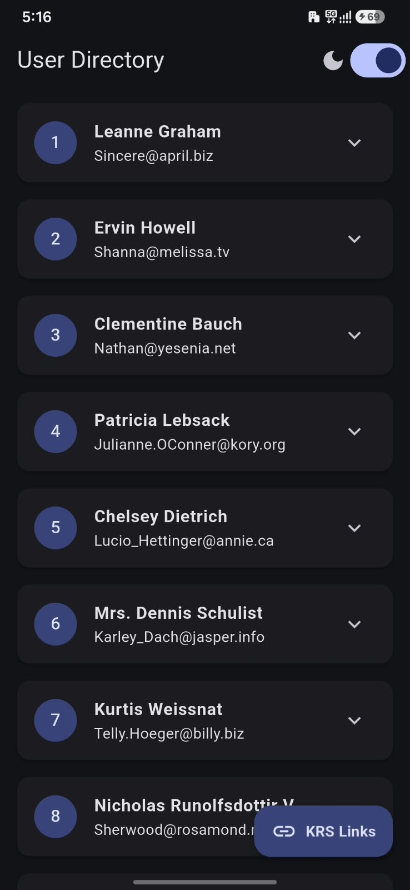

# User Directory App

A Flutter mobile application that displays a list of users fetched from the JSONPlaceholder API and presents their details in an elegant, expandable directory layout.

## Features

- Fetches live user data from JSONPlaceholder
- Displays user cards with names, emails, usernames, and addresses
- Expandable details for each user
- Light and dark theme toggle
- KRS quick links via floating action button
- Android APK build ready for release

## APK Download

The latest Android release APK is available here:

- [Download APK](https://drive.google.com/file/d/1HjdlCyqXAoqO4lkAvrwFdv3EhcJx2qT5/view?usp=sharing)

### Install on Android

1. Download the APK file from the link above.
2. On your Android device, enable installation from unknown sources if prompted.
3. Open the APK file and follow the installation steps.
4. Launch the app after installation.

## Screenshots

App preview:

<p align="center">
  
</p>

This app includes:

- user directory list
- expandable profile cards
- theme switch support
- quick access to KRS social links

## Tech Stack

- Flutter
- Dart
- Provider for state management
- HTTP client for API calls
- URL launcher for external links

## Project Structure

```text
lib/
  main.dart
  home_screen.dart
  splash_screen.dart
  theme_provider.dart
  user_model.dart
build/
  app/
    outputs/
      apk/
        release/
          app-release.apk
```

## Run Locally

### Prerequisites

- Flutter SDK installed
- Android Studio or VS Code configured for Flutter
- An Android emulator or physical Android device

### Commands

```bash
flutter pub get
flutter run
```

### Build release APK

```bash
flutter build apk --release
```

The APK will be generated under:

```text
build/app/outputs/apk/release/app-release.apk
```

## Author

Prateek Raj

## License

This project is for educational and personal use.
